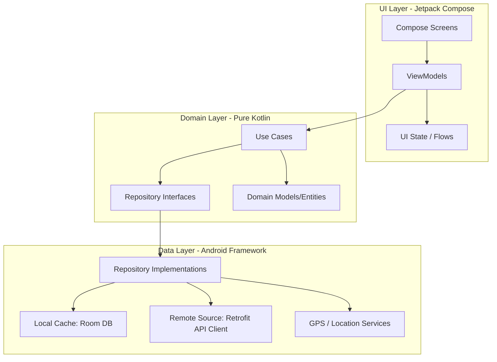
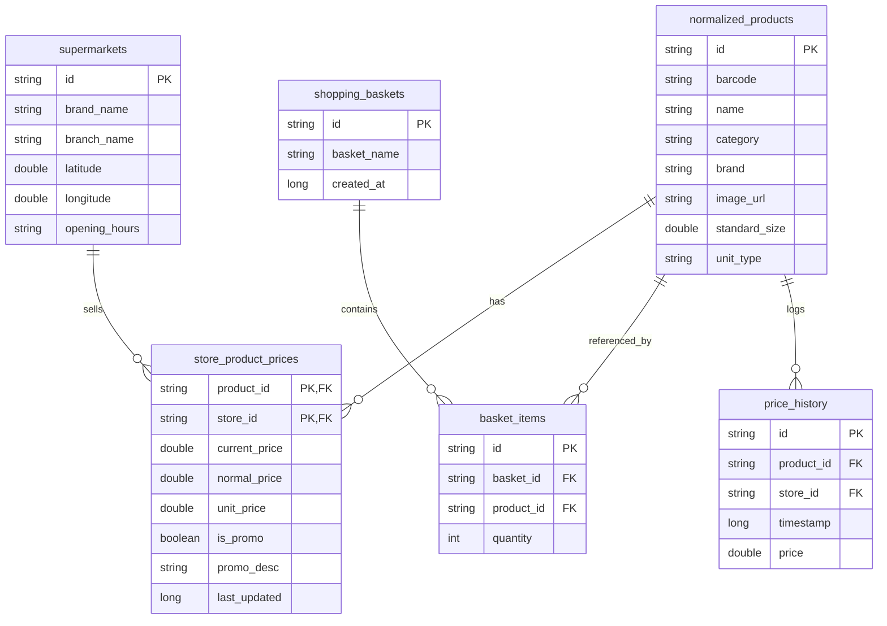
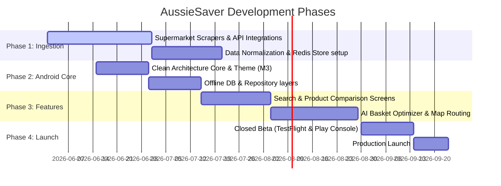

# AussieSaver - Aussie Groceries Price Comparison & Budgeting App
## Technical Architecture, UI/UX Design System, and Backend Specification

AussieSaver is a premium, high-performance, and family-friendly Android application designed to help Australian consumers combat the rising cost of living by comparing grocery prices in real-time across Coles, Woolworths, ALDI, IGA, and Costco.

---

## 1. Brand Identity & Design System

AussieSaver's visual style blends the trustworthiness of a premium fintech application (like CommBank or Up Bank) with the vibrant, fresh appeal of a food and lifestyle app.

### Color Palette (Material Design 3 Token Mapping)
*   **Primary (Fresh Mint/Forest Green):** `#00C853` (Representing fresh food, savings, and organic growth)
*   **Primary Container (Soft Mint):** `#E8F5E9`
*   **Secondary (Dusk Navy):** `#1A237E` (Trust, stability, and clean typography)
*   **Tertiary (Golden Wattle):** `#FFD700` (Used exclusively for specials, discount badges, and half-price alerts)
*   **Background (Light Mode):** `#F8F9FA`
*   **Background (Dark Mode):** `#121212`
*   **Surface Variant:** `#FFFFFF` (Light) / `#1E1E1E` (Dark)
*   **Error / Inflation Alert:** `#D50000`

### Typography (Google Fonts: Outfit)
*   **Display Large:** Outfit Bold, 32sp (For major savings numbers and hero statistics)
*   **Headline Medium:** Outfit SemiBold, 20sp (Screen headers and card titles)
*   **Body Large:** Outfit Medium, 16sp (Product names, list descriptions)
*   **Label Medium:** Outfit Regular, 12sp (Unit prices, supermarket badges)

### Visual Accents & Micro-Animations
*   **Glassmorphism:** Bottom navigation bar and floating basket button utilize a subtle blur effect (`BlurEffect` API in Jetpack Compose).
*   **Spring Animations:** Shopping list additions animate with a bouncy physical spring effect (`spring(dampingRatio = Spring.DampingRatioMediumBouncy)`).
*   **Shimmer Effect:** Product card placeholders fade in with a multi-layered gradient shimmer during asynchronous API fetches.

---

## 2. Android App Architecture

The client app is architected around **Clean Architecture** principles combined with **MVVM (Model-View-ViewModel)**.



### Key Frameworks & Dependencies
*   **Dependency Injection:** Dagger Hilt (`@HiltAndroidApp`, `@AndroidEntryPoint`)
*   **Asynchronous Processing:** Kotlin Coroutines & StateFlow for reactive, lifecycle-aware state updates.
*   **Navigation:** Jetpack Compose Navigation Component (type-safe destinations).
*   **Local Storage:** Room Database with SQLCipher support for localized credentials/offline caching.
*   **Network:** Retrofit 2 + OkHttp 4 (with interceptors for auth headers and offline caching).
*   **Image Loading:** Coil (Coroutines Image Loader) with local disk caching and webp decoding.
*   **Charts:** Patryk (or customized Canvas-based Compose drawing for high performance).

### Folder Structure Directory Layout
```
com.aussiesaver.app/
│
├── di/                           # Dependency Injection Modules (NetworkModule, DatabaseModule, RepositoryModule)
├── data/                         # Data Layer
│   ├── local/
│   │   ├── db/                   # Room Database, Type Converters
│   │   ├── dao/                  # Data Access Objects (ProductDao, BasketDao, StoreDao)
│   │   └── entity/               # Database Entities
│   ├── remote/
│   │   ├── api/                  # Retrofit API Interfaces
│   │   └── dto/                  # Data Transfer Objects (Network models)
│   └── repository/               # Repository Implementations (fetching with offline-first strategies)
│
├── domain/                       # Domain Layer (Business Logic)
│   ├── model/                    # Pure Kotlin Domain Objects (NormalizedProduct, BasketTotal)
│   ├── repository/               # Repository Interfaces
│   └── usecase/                  # Use Cases (GetCheapestBasketUseCase, SearchNormalizedProductsUseCase)
│
└── presentation/                 # Presentation/UI Layer
    ├── theme/                    # Color, Type, Theme definitions (Material 3)
    ├── common/                   # Shared UI Components (ProductCard, SavingsBadge, SupermarketChip)
    ├── dashboard/                # Home/Dashboard MVVM module
    ├── search/                   # Product Search & Comparison MVVM module
    ├── basket/                   # Basket & Split-Shopping optimizer MVVM module
    ├── specials/                 # Specials & Deals engine MVVM module
    └── assistant/                # AI Chat Assistant MVVM module
```

---

## 3. Database Design & Room Schema

The local Room DB acts as an offline cache and stores user-specific configurations (favorites, custom lists, offline-loaded stores).

### Room Database Schema Diagram



---

## 4. UI/UX Wireframe & Screen Mockup Descriptions

### 1. Home Dashboard
*   **Layout:** Vertical scroll with sticky header.
*   **Header:** User greeting, localized location selector (e.g., "Richmond, VIC 3121"), and search box with voice search icon.
*   **Weekly Savings Tracker:** A large ring-chart displaying total saved this month (e.g., "$142.50 Saved") with green gradients.
*   **Inflation Card:** A card comparing this week's staple basket price to 3 months ago (e.g., "+2.4% vs Mar 2026").
*   **Quick Actions Grid:** Four key shortcut actions: "Scan Barcode", "Split Shop Optimizer", "Specials Today", "AI Savings Plan".
*   **Deals of the Day Carousel:** Highlighted half-price deals matching user favourites.

### 2. Product Search & Comparison
*   **Layout:** Search input field with auto-suggest, list/grid toggle, and multi-select filter chips (Supermarkets, Category, Unit Price, On Special).
*   **Comparison Cards:** Expanding cards showing:
    *   Product image and title (e.g., "Devondale Long Life Milk Full Cream 1L").
    *   Horizontal list of supermarkets sorted by lowest price:
        *   **ALDI Badge:** `$1.60` (Cheapest highlighted in bold green)
        *   **Woolworths Badge:** `$1.85` (Was `$2.10`, Special)
        *   **Coles Badge:** `$1.85`
        *   **IGA Badge:** `$2.15`
    *   An expandable panel showing historical lowest price and a warning if a "fake special" is detected (e.g., "Special is identical to average price over the last 90 days").

### 3. Basket Comparison & Split-Shopping Optimizer
*   **Layout:** Two-tab view: "Single Store" vs "Split-Shop Recommendation".
*   **Single Store Tab:**
    *   Horizontal bar charts comparing totals:
        *   **Costco:** `$114.50` (Note: Requires Membership)
        *   **ALDI:** `$118.20`
        *   **Woolworths:** `$132.40`
        *   **Coles:** `$134.10`
*   **Split-Shop Tab (AI-Powered Optimizer):**
    *   Split recommendation:
        *   **Store A (ALDI - Richmond):** Buy 12 items for `$64.20`
        *   **Store B (Woolworths - Victoria Gardens):** Buy 4 items (Specials only) for `$24.50`
    *   **Total:** `$88.70` (Total Savings: `$29.50` over single-store Woolworths checkout).
    *   Interactive map button displaying route driving directions to both stores.

### 4. AI Chat Assistant
*   **Layout:** Clean chat interface with quick prompt chips at the bottom.
*   **Assistant Tone:** Conversational, helpful, and localized (uses Australian terminology like "brekkie", "woolies", "coles").
*   **Sample Conversation:**
    *   *User:* "Find me the cheapest healthy breakfast options this week."
    *   *AI:* "I've checked local stores in Fitzroy. Uncle Tobys Rolled Oats 1kg is currently half-price at Woolies for $3.25. Pair that with ALDI's Farmdale Milk ($1.60) and IGA's fresh bananas ($3.99/kg). Total breakfast cost per serve: $0.48!"

---

## 5. API Architecture & Backend Normalization

Supermarket APIs do not follow standardized schemas. AussieSaver's backend maps different supermarket APIs into a single normalized data structure.

### Normalization Process
1.  **Ingestion:** Web scrapers and official API integrations pull raw price feeds.
2.  **Matching Engine:** Levenshtein distance algorithms, brand matching, and barcode lookups normalize products into a canonical format (e.g., "Devondale Milk 1L" is mapped to `COLES_18374` and `WOOLWORTHS_928374`).
3.  **Caching:** Redis stores active daily prices, serving them with sub-10ms response times.

### Sample REST API Payload: Product Details & Comparison
`GET /api/v1/products/compare?barcode=9310072001222`

```json
{
  "product_id": "prod_devondale_1l_fullcream",
  "barcode": "9310072001222",
  "name": "Devondale Long Life Full Cream Milk",
  "brand": "Devondale",
  "size": 1.0,
  "unit": "L",
  "image_url": "https://cdn.aussiesaver.com.au/products/9310072001222.webp",
  "comparisons": [
    {
      "supermarket_id": "aldi_vic_richmond",
      "supermarket_name": "ALDI",
      "branch_name": "Richmond",
      "current_price": 1.60,
      "is_promo": false,
      "unit_price": 1.60,
      "last_updated": "2026-05-26T06:00:00Z"
    },
    {
      "supermarket_id": "woolworths_vic_richmond",
      "supermarket_name": "Woolworths",
      "branch_name": "Richmond Plaza",
      "current_price": 1.85,
      "normal_price": 2.20,
      "is_promo": true,
      "promo_description": "Save 35c",
      "unit_price": 1.85,
      "last_updated": "2026-05-26T05:30:00Z"
    },
    {
      "supermarket_id": "coles_vic_richmond",
      "supermarket_name": "Coles",
      "branch_name": "Richmond Central",
      "current_price": 1.85,
      "normal_price": 1.85,
      "is_promo": false,
      "unit_price": 1.85,
      "last_updated": "2026-05-26T05:45:00Z"
    }
  ],
  "cheapest_option": {
    "supermarket_name": "ALDI",
    "price": 1.60,
    "potential_savings_percent": 13.5
  }
}
```

---

## 6. Implementation & Launch Roadmap



### Future Roadmap
1.  **Loyalty Card Integration:** Digital wallet inside AussieSaver to scan Everyday Rewards, Flybuys, and ALDI app loyalty codes.
2.  **Shared Collaborative Lists:** WebRTC powered real-time family list synchronization.
3.  **Receipt Scanner:** OCR technology allowing users to upload physical receipts and automatically track savings history without manual list building.
